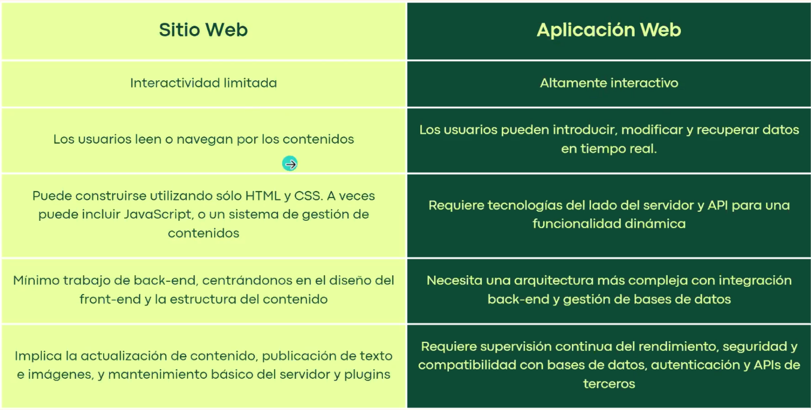
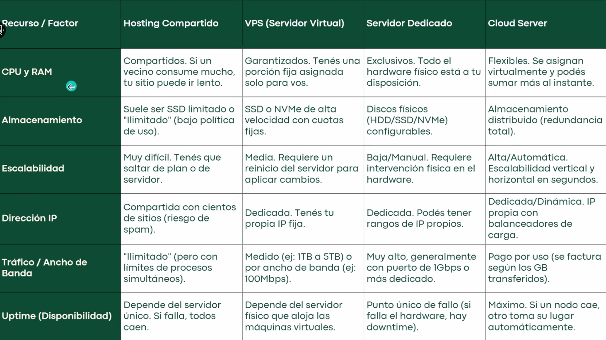

# Clase 1

- 50 práctica 50 teoría
- 2 parciales, tp final
- 6 unidades
  - 1, 2, 3 parcial 1
  - 4, 5, 6 parcial 2

 

## Teoría

- Conceptos básicos sobre sistemas de servidores
- Sitio web:
  - Orientado a presentar información
  - Contenido estático
  - Basado en páginas
  - Baja complejidad
- Aplicación web:
  - Orientada a la ejecución de lógica y procesos
  - Alta interacción con el usuario

- Arquitectura web:
  - Arquitectura de software que describe cómo se organiza un sistema web, cómo interactúan el frontend y backend y cómo se comunican
- Arquitectura cliente-servidor:
  - Cliente que inicia la comunicación y solicita contenido
  - Servidor que procesa la lógica y responde
- Capas:
  - Controlador:
    - Reciben peticiones
    - Validan datos
    - Llaman a los servicios
    - Responden
  - Servicio:
    - Contienen la lógica
    - Llama a modelos para acceder a datos
  - Modelo:
    - Acceden a datos de la base de datos
    - Representa una entidad
  - Vista:
    - Muestra los datos al usuario
- Conceptos:
  - API Gateway: gestiona, enruta y asegura el tráfico de solicitudes entre clientes externos y un conjunto de microservicios o servicios de backend.
  - Servidor proxy: actúa entre un dispositivo e internet.
- Protocolo TCP/IP
- HTTP/HTTPS
  - Métodos
  - Códigos
- Servidores
- Servicios de Hosting
  - Hosting compartido
  - Servidor dedicado
  - VPS
  - Cloud hosting

  
